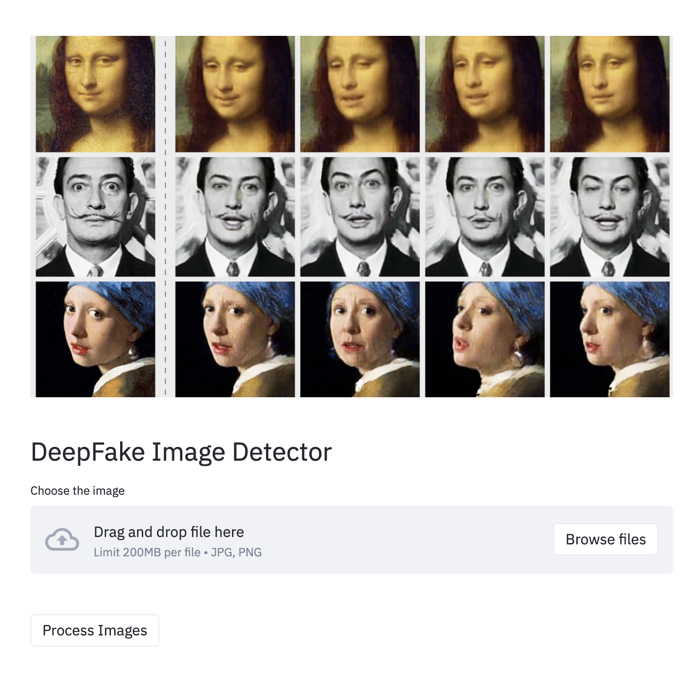

# DeepFake-Detection-WebApp
This WebApp takes an uploaded .PNG or .JPG file as an input and classifies if the image is real or fake.

The internet is filled with fake photos, this is an attempt to help people use a deep learning based free webapp to check what is the probability that the image they are seeing is fake/real.

Have fun! Happy browsing!

